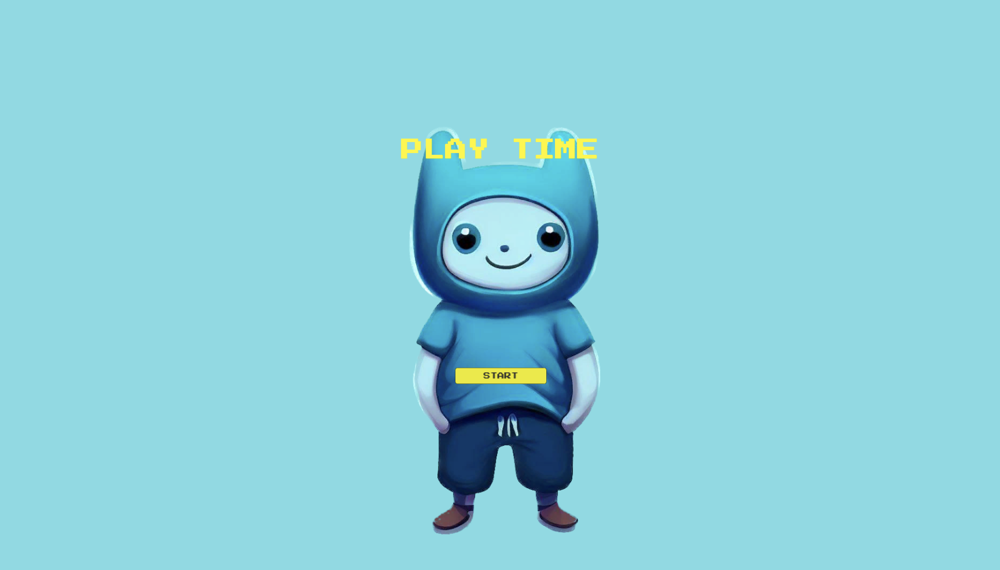
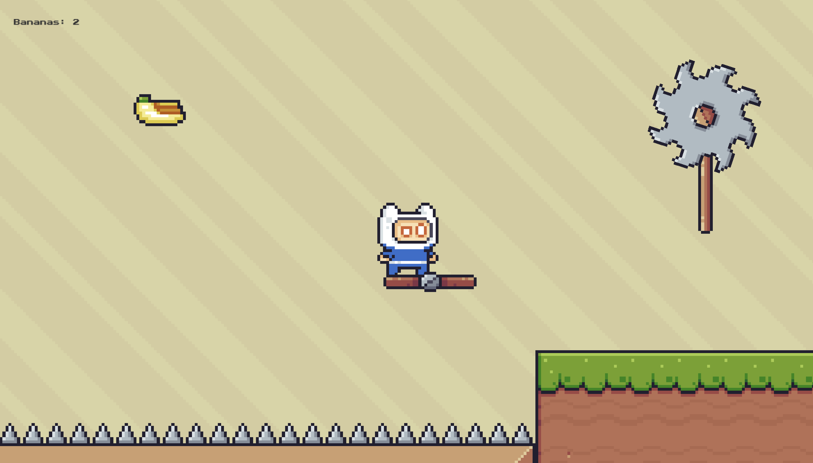

# Play Time

An Android mobile 2D game, which gives an opportunity to play with a character by simply tapping on
the screen.

## PROJECT SPECIFICATION

• Programming language: [C#](https://learn.microsoft.com/en-us/dotnet/csharp/tour-of-csharp/);

• Interface: [Unity](https://unity.com/unity-hub);

• SDK: [Unity](https://unity.com/developer-tools);

• Web content hosting: [Firebase Hosting](https://firebase.google.com/docs/hosting);

• Domain: [web.app](https://web.app);

• CI/CD: [GitHub Actions](https://docs.github.com/en/actions) is used to deploy the updated game to
[play-time-2d.web.app](https://play-time-2d.web.app) after every push to the main branch.

• **Code Readability:** code is easily readable such that a fellow programmer can understand the
purpose of the app, all variables, methods, and resource IDs are descriptively named such that
another developer reading the code can easily understand their function, no unnecessary blank lines,
no unused variables or methods, no commented out code.

• Screenshots:

<!--suppress CheckImageSize -->

